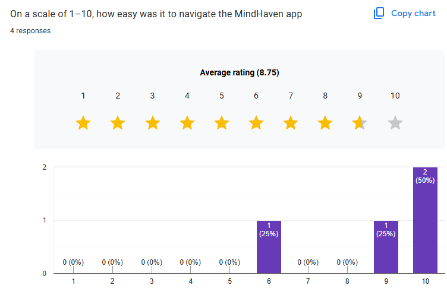
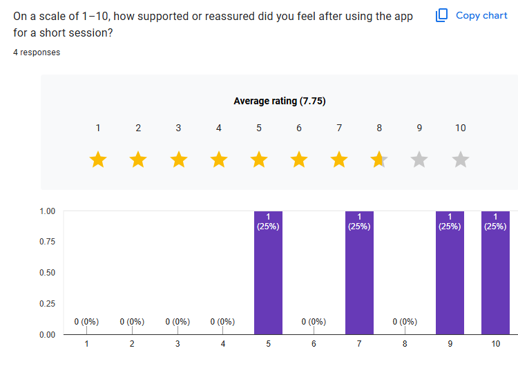
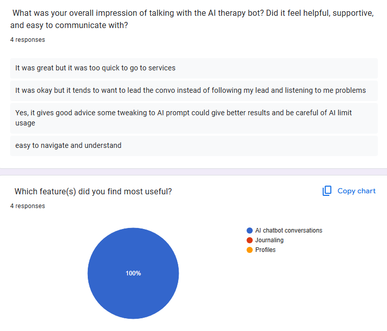
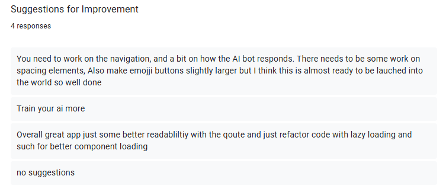

# MindHaven


<a id="readme-top"></a>


---

## Table of Contents
- [About MindHaven](#about-mindhaven)
- [Built With](#built-with)
- [Environment Variables](#environment-variables)
- [How To Install](#how-to-install)
- [Features](#features)
- [Future Implementations](#future-implementations)
- [Development Process](#development-process)
  - [Challenges](#challenges)
- [Usage](#usage)
  - [Try It Yourself](#try-it-yourself)
- [Mockups](#mockups)
- [Permissions](#permissions)
- [Troubleshooting](#troubleshooting)
- [License](#license)
- [Contributing](#contributing)
- [Authors](#authors)
- [Contact](#contact)
- [Acknowledgements](#acknowledgements)
- [Demonstration Video](#demonstration-video)


<p align="right"><a href="#readme-top">[⬆️ Back to top]</a></p>

---

# About MindHaven

**MindHaven** is a calm, mobile-first space to chat, reflect, and keep track of how you’re doing.  
It combines a compassionate **Therapy Buddy** chat, lightweight **journaling**, **motivational quotes**, and **voice-to-text** so you can speak or type when it’s easier.

The conversational experience is powered by a hosted LLM (via the **Groq OpenAI-compatible API**) with a carefully designed prompt that keeps replies warm, brief, and consent-based.  
Data such as users, chats, and journals is stored securely in **Firebase**.

---

## Built With

<p align="left">
  <a href="https://reactnative.dev/"></a>
  <a href="https://expo.dev/"></a>
  <a href="https://firebase.google.com/"></a>
  <a href="https://www.typescriptlang.org/"></a>
  <a href="https://reactnavigation.org/"></a>
</p>

Additional libs: `react-native-voice`, `expo-av`, `expo-file-system`, `@react-native-async-storage/async-storage`.

---

## Environment Variables

Create a **.env** file in your root directory and include:
```bash
EXPO_PUBLIC_AI_BASE=https://api.groq.com/openai/v1
EXPO_PUBLIC_AI_MODEL=llama-3.1-8b-instant
EXPO_PUBLIC_AI_TOKEN=YOUR_GROQ_API_KEY
EXPO_PUBLIC_FIREBASE_API_KEY=YOUR_FIREBASE_WEB_API_KEY
EXPO_PUBLIC_GOOGLE_API_KEY=YOUR_GOOGLE_CLOUD_API_KEY
```
###  Where to Get the Keys

| Key | Source | Instructions |
|------|---------|--------------|
| **EXPO_PUBLIC_AI_BASE** | Groq | Use `https://api.groq.com/openai/v1` |
| **EXPO_PUBLIC_AI_MODEL** | Groq | Use model name `llama-3.1-8b-instant` |
| **EXPO_PUBLIC_AI_TOKEN** | Groq | Create an API key at [groq.com](https://groq.com) → **Dashboard → API Keys** |
| **EXPO_PUBLIC_FIREBASE_API_KEY** | Firebase | From [Firebase Console](https://console.firebase.google.com) → **Project Settings → General → Web App Config** |
| **EXPO_PUBLIC_GOOGLE_API_KEY** | Google Cloud | From [Google Cloud Console](https://console.cloud.google.com) → **Enable Speech-to-Text API → Create Credentials → API Key** |

 **Important:**  
- Never commit `.env` files or share API keys publicly.  
- Add `.env` to your `.gitignore`.  
- For production, route sensitive API calls through a secure backend.

---

## How To Install
### 1. Clone the Repo

You can either:
- **Option A:** Click "Code" on the [GitHub repo](https://github.com/ZanderBez/MindHaven), then choose "Open with GitHub Desktop"
- **Option B:** Use the terminal to clone the repo:
```bash
git clone https://github.com/ZanderBez/MindHaven
```

### Step 2: Open the Project Directory
If using the terminal:
```bash
cd MindHaven
```
If using GitHub Desktop, the folder should be opened automatically in your editor after cloning.

#### Configure Environment
Create `.env` as above and confirm Firebase settings in `firebase.tsx`.

### Step 3: Install Dependencies

```bash
npm install
```
### Step 4: Run Locally

```bash
npx expo start
```
- Scan the QR with Expo Go (Android/iOS), or Press a for Android emulator, i for iOS simulator.
<p align="right"><a href="#readme-top">[⬆️ Back to top]</a></p>

## Features

| Feature | Description |
|----------|--------------|
| Therapy Buddy | AI chat powered by Groq  |
| Voice-to-Text | Record & transcribe messages. |
| Journals | Create and manage private reflections. |
| Chats | Persistent threads with message history. |
| Motivation | Daily quotes to boost positivity. |
| Onboarding | Introduces users to app features. |
| Authentication | Secure Firebase login & signup. |
| Profile | Update details & profile image. |

---
---

## User Testing & Improvements

As part of the **MindHaven usability evaluation**, four participants tested the app’s navigation, chatbot interaction, and overall user experience. Below are the summarized findings and resulting improvements.

###  Navigation Feedback


**Average Rating:** 8.75 / 10  
Most users found navigation intuitive and clean, though one suggested improving button spacing and alignment for better accessibility.

**Implemented Improvements:**
- Increased spacing between buttons on the Home and Chat screens.  
- Adjusted touchable areas for emoji reaction buttons to make them easier to tap. 

---

### AI Therapy Bot Feedback


**User Comments:**
> “It was great but it was too quick to go to services.”  
> “It tends to want to lead the convo instead of listening.”  
> “Gives good advice but prompt could use tweaking.”  

**Average Support Rating:** 7.75 / 10  

**Implemented Improvements:**
- Refined the **AI prompt** to focus more on reflective listening rather than leading advice.  
- Added **longer response delay** and context retention between messages to feel more natural.  
- Tweaked tone parameters for warmth and empathy.

---

### Most Useful Feature


All participants (100%) rated the **AI Chatbot Conversations** as the most useful feature.  
This validates the focus on conversational wellness as the app’s core experience.

---

###  Suggestions for Improvement


**Common Feedback:**
- Improve navigation spacing and readability.  
- Train AI model for better contextual follow-up.  
- Refactor some UI components for smoother performance.  

**Implemented Actions:**
- Updated navigation layouts and improved padding.  
- Refined AI prompt handling logic to better follow user input.  
- Began restructuring certain components to reduce render delays.

---

Overall, testers described MindHaven as:
> “Easy to navigate and understand.”  
> “Almost ready to be launched into the world — well done!”

---


## Future Implementations

- Helpline integration (region-specific)
- Daily reminders & streak tracking
- Offline journals & PDF export
- Multilingual support
- End-to-end encryption
- Admin analytics for chat safety

---

## Development Process

### Highlights
- **Empathetic AI** — Warm and consent-based dialogue design  
- **Voice Integration** — Google Speech-to-Text for seamless voice entries  
- **Firebase First** — Simple, reliable realtime database  
- **Clean Architecture** — Reusable service hooks & components  

### Challenges
- Securing API keys  
- iOS microphone handling  
- State synchronization for AI replies  
- Cross-device UI consistency  

---

## Usage

1. Open the app — see the splash screen  
2. Sign up or log in via Firebase  
3. Read the onboarding guide  
4. Start chatting or journaling  
5. Save entries or transcribe voice notes  
6. Track progress and stay motivated  

<p align="right"><a href="#readme-top">[⬆️ Back to top]</a></p>

---
### Try It Yourself

1. Install **Expo Go**  
   - [iOS](https://apps.apple.com/app/expo-go/id982107779)  
   - [Android](https://play.google.com/store/apps/details?id=host.exp.exponent)

2. Run locally with:
```bash
npx expo start
```
3. Scan the QR to open **MindHaven** instantly.

---
## Mockups

Add screenshots in your `ReadMeAssets/` folder and reference them here:

- 
- 
- 
- 
- 
- 
- 
- 
- 
- 
- 


---

## Permissions
**iOS:**  
`NSMicrophoneUsageDescription`, `NSSpeechRecognitionUsageDescription`, `NSPhotoLibraryUsageDescription`

**Android:**  
`RECORD_AUDIO`, file/media access

---
## Troubleshooting

| Issue | Fix |
|-------|-----|
| AI key missing | Check `.env` file |
| No audio | Grant microphone access |
| Firebase error | Verify Auth + Firestore rules |
| Blank AI reply | Retry; may be network or rate limit |

---

## License
MIT © MindHaven.  
See [LICENSE](./LICENSE) for details.

---
## Contributing

1. Fork the repo  
2. Create a new branch (`git checkout -b feature/NewFeature`)  
3. Commit (`git commit -m "Add new feature"`)  
4. Push (`git push origin feature/NewFeature`)  
5. Open a Pull Request  

---

## Authors
- **Zander Bezuidenhout** — [GitHub](https://github.com/ZanderBez)

---

## Contact
📧 bezuidenhoutzander8@gmail.com

---

## Acknowledgements

- **Open Window — School of Creative Technologies**  
- **Expo** — runtime  
- **Firebase** — authentication & storage  
- **Groq** — LLM API  
- **Google Cloud STT** — transcription  
- **Shields.io** — badges  
- **Quotable API** — motivational quotes  

---

## Demonstration Video
[MindHaven Demo Video](https://your-demo-link)

<p align="right"><a href="#readme-top">[⬆️ Back to top]</a></p>